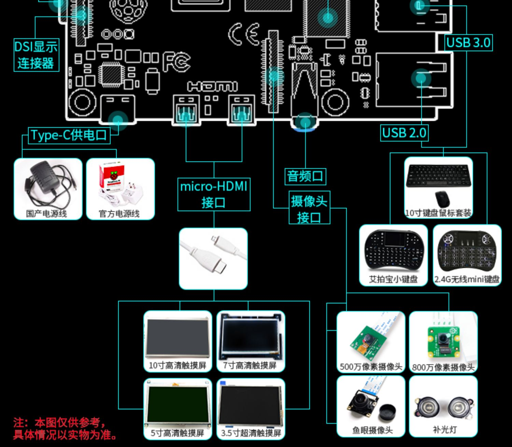

# 🔥录系统

```shell
// 查看磁盘
df -lh

// 卸载磁盘
sudo diskutil umount /dev/disk2s1

// 再次确认磁盘
df -lh

// 开始写入文件，烧录系统（成功后磁盘管理里面看到多了个boot磁盘，说明写入文件成功）
dd bs=1m if=./2020-05-27-raspios-buster-full-armhf.img of=/dev/rdisk2

// 在sd卡中设置空白的ssh文件，开启ssh链接
cd /Volumes/boot/ && touch ssh

// 卸载sd卡（成功写入了系统的sd卡可以插入到树莓派中启动啦）
diskutil unmountDisk /dev/disk2
```

# 🔗树莓派

- Mac 通过网线直连控制树莓派
  - 系统偏好设置-共享-互联网共享开启
  - 查看树莓派分配的ip `arp -a`（带有bridage）
  - `ssh pi@ip` or `ssh pi@raspberrypi.local`
- 图形化控制树莓派 [VNC](https://www.realvnc.com/en/connect/download/viewer/)
  - `sudo raspi-config`
  - 选择5 interfacing options
  - 选择3 VNC
  - 链接Wi-Fi，后续通过无线控制树莓派
    - 获取ip方式1: 可视化窗口，鼠标移动到右上角WI-FI信号处悬浮停留
    - 获取ip方式2: 路由器查看设备分派ip
  - VNC 链接后报`cannot currently show the desktop`: 
    - `sudo raspi-config`
    - 选择7 Advanced Options
    - 选择A5 Resolution
    - 选择喜欢的分辨率

# 常用ssh指令

```shell
// 关机
sudo shutdown -h now
```

